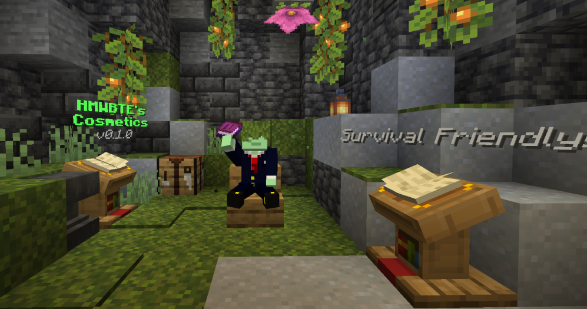

# HMWBTE's Cosmetics



This datapack lets you customize your survival experience without needing cheats / commands.  With this datapack, you can give items custom names and lore, custom models, or even create a hologram of text!

This datapack is a work in progress, so please report any issues or inconveniences you find!

## Credits

Some ideas and code were adapted from Vanilla Tweaks' *Armor Statues* Datapack, in compliance with their terms & conditions.
The original datapack can be found on the [Vanilla Tweaks website](https://vanillatweaks.net)

## How to install

First, add the datapack in the create world menu, or by placing it in the `datapacks` folder of an existing world.

If you want to use custom models, you need a resource pack.  It is recommended to base that resource pack off the template here, to ensure the models get used properly.

I might make a tool for generating a resource pack later, but no promises.

If you are adding the datapack to a server and want to disable features, then you can use any of the following commands:

```mcfunction
data modify storage permissions:config hat set value false

data modify storage permissions:config sit set value false

data modify storage permissions:config custom_text set value false

data modify storage permissions:config custom_models set value false

data modify storage permissions:config holograms set value false
```

## How to use

### Holograms
  
To create a hologram, write a book (it does not have to be signed) then rename it *HOLOGRAM* using an anvil.  Placing this book on a lectern will automatically summon the hologram.  See [below](#formatting-guide) for a guide on how to format the hologram.

To edit the contents of the hologram, just remove the book from the lectern, make the changes you want, and replace it.

To adjust the position, rotation, size, etc. of the hologram you can use the Configurator book.  This book can be obtained by signing a book "Holograms" (case sensitive), or by running the following command:
```
function hologram:give_book
```

### Custom Names / Lore

To give an item a custom name, write a book and rename it *NAME*.  Next, hold the book in your offhand and the item you want to modify in your mainhand.  Then run this command:
```
trigger custom_name
```

The process is almost identical for custom lore, but instead you rename the book *LORE* and run this command:
```
trigger custom_lore
```

For a guide on how to format names / lore, see [below](#formatting-guide).

### Formatting Guide

Several utilities use a written / writable book to generate formatted text.  The contents of such books follow a simple markup pattern, with the following commands:

Command | Result
-|-
`%bold%` | Turns bold on or off
`%italic%` | Turns italics on or off
`%obfuscate%` | Turns obfuscation (the glitchy random text) on or off
`%underline%` | Turns underlining on or off
`%strikethrough%` | Turns strikethrough (line through the text) on or off


There are also commands for color, which more or less follow the naming convention of colors in game (e.g. concrete).  Here a list of all of them in no particular order:
```
%black% %blue% %cyan% %green% %lightblue% %orange% %pink% %brown% %red% %magenta% %purple% %lime% %yellow% %gray% %lightgray% %white% %aqua% %darkred% %gold% 
```

### Formatting Example

The following written book:
```
%bold%%yellow%Title
%bold%%white%Lorem ipsum dolor sit amet
```
Will produce the following formatted output (image shows a formatted hologram):


### Actions

This datapack also provides some simple actions to allow a player to sit on a stair/slab, or to equip an item as a hat.

The triggers for both are, respectively:
```
trigger hat

triggger sit
```

Please note that the player must be standing on the block they wish to sit on.

### Custom Models

&#x26a0; This feature may be changed or replaced in the future! &#x26a0;

To give an item a custom model, you should first make sure it exists in a resource pack.  This means that the desired [item model](https://minecraft.wiki/w/Items_model_definition) should be specified in the `shared:custom` resource location.

For example, if I wanted to have a custom model named "witherbuster", I would need to make sure the file `./assets/shared/items/custom.json` looked something like this:
```jsonc
{
  "model": {
    "type": "minecraft:select",
    "property": "minecraft:custom_model_data",
    "cases": [
      {
        // If the "witherbuster" string is present, give
        // the item the witherbuster model
        "when": "witherbuster",
        "model": {
          "type": "minecraft:model",

          // Example location
          "model": "location:item/witherbuster"
        }
      }
    ]
  }
}
```
This datapack always assumes that `shared:custom` is a "select" type, and so only provides string values for the `minecraft:custom_model_data` property. 

To set the custom model data, hold a named paper in your offhand and run the following command:
```
trigger custom_model
```
This will set model string of the mainhanded item to the name of the paper, which should match a string in the resource pack.

To remove a custom model, hold the item in your mainhand and run
```
trigger remove_model
```
This should revert the items model to its id. Currently, additional testing is needed for reliability.